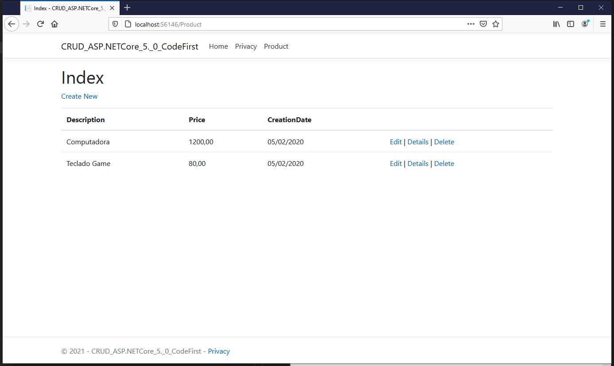
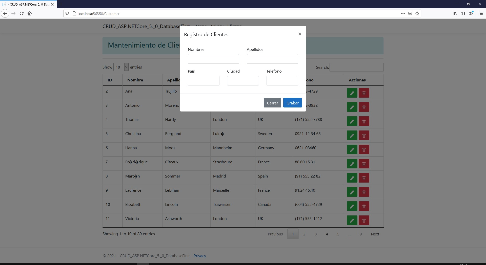

# CRUD MVC ASP.NETCore 5.0

- Code First (Código primero) : 
    - Vistas creadas por Scaffolding

    

- Database First (Database primero) : 
    - El listado se muestra en un PartialView.
    - Se realizó la petición de la Partial View utilizando Ajax.
    - Se añadió estilos de Bootstrap para mejorar el diseño de la tabla.
    - Se agregó Datatables para mejorar el listado de registros.

    

# Gracias
